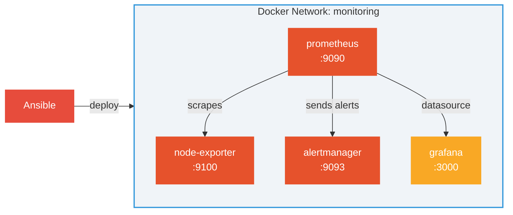
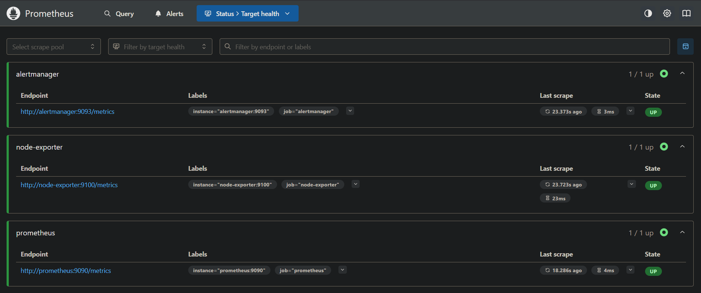
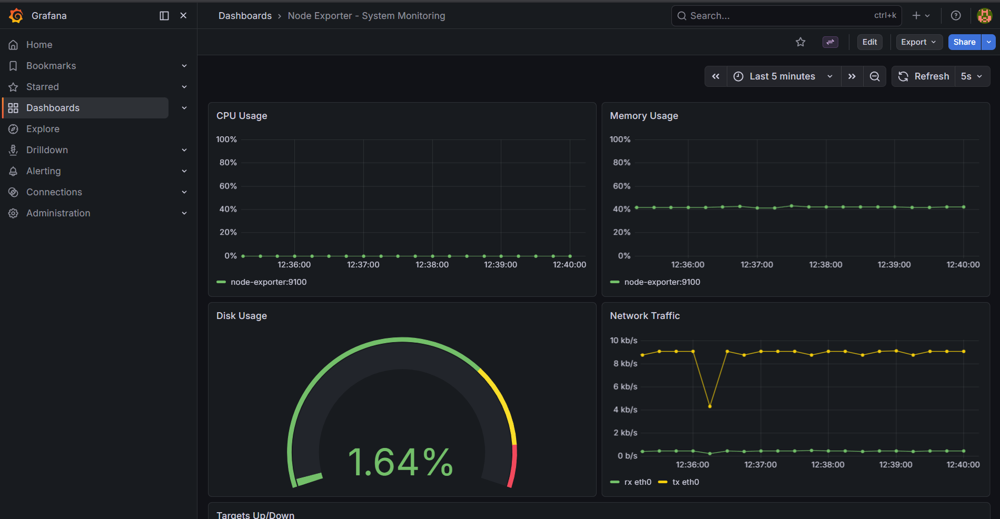
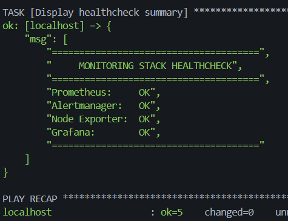

# ansible-monitoring-stack


## Description

Automated deployment of an industry-standard monitoring stack using **Ansible**, targeting **Docker containers as managed hosts** (no SSH, no VMs, no cloud).

This project deploys the **Prometheus + Node Exporter + Alertmanager + Grafana** stack -the de facto standard in the modern DevOps/Kubernetes ecosystem. It appears in the vast majority of DevOps job postings and is the monitoring foundation behind most production Kubernetes clusters.

Everything runs locally via Docker, making it easy to demo, test, and explain in interviews.

## Architecture



**How it works:**
- **Ansible** provisions and configures all containers via the Docker socket (`community.docker` collection) -no SSH needed.
- **Prometheus** scrapes metrics from Node Exporter, evaluates alert rules, and forwards firing alerts to Alertmanager.
- **Grafana** queries Prometheus as a datasource for visualization dashboards.
- All containers communicate over a dedicated Docker network (`monitoring`).

## Prerequisites

- **Docker** installed and running
- **Ansible ≥ 2.14** with Python 3.x
- **community.docker** Ansible collection

## Setup

### 1. Install the required Ansible collection

```bash
ansible-galaxy collection install community.docker
```

### 2. Create the Vault password file

```bash
echo 'your-secure-vault-password' > .vault_pass
chmod 600 .vault_pass
```

> `ansible.cfg` already references `.vault_pass`, so no need to pass `--vault-password-file` on every command.

### 3. Recreate the vault secrets file

The vault file is committed encrypted. To recreate it from scratch:

```bash
ansible-vault decrypt inventory/group_vars/all.vault.yml
```

Or create a new one with:

```bash
cat > inventory/group_vars/all.vault.yml << 'EOF'
grafana_admin_password: "SuperSecretGrafana123!"
alertmanager_webhook_url: "http://localhost:9999/webhook"
EOF
ansible-vault encrypt inventory/group_vars/all.vault.yml
```

### 4. Deploy the monitoring stack

```bash
ansible-playbook playbooks/deploy.yml
```

### 5. Verify all services are healthy

```bash
ansible-playbook playbooks/healthcheck.yml
```

### 6. Access the services

| Service        | URL                          |
|----------------|------------------------------|
| Prometheus     | http://localhost:9090         |
| Grafana        | http://localhost:3000         |
| Alertmanager   | http://localhost:9093         |
| Node Exporter  | http://localhost:9100/metrics |

Default Grafana credentials: `admin` / *(password from vault)*

### 7. Tear down the stack

```bash
ansible-playbook playbooks/teardown.yml
```

## Ansible Concepts Demonstrated

| Concept | Where in the project | Why it matters |
|---|---|---|
| Roles | `roles/prometheus/`, `roles/grafana/`... | Reusability, separation of concerns |
| Inventory | `inventory/hosts.ini` | Defines managed hosts (here: Docker containers) |
| group_vars | `inventory/group_vars/all.yml` | Shared variables across all roles |
| Ansible Vault | `all.vault.yml` | Secret encryption -never commit plaintext secrets |
| Templates Jinja2 | `prometheus.yml.j2`, `datasource.yml.j2`... | Dynamic configs injected from variables |
| Handlers | `roles/*/handlers/main.yml` | Conditional reload -avoids unnecessary restarts |
| Idempotence | All playbooks | Run N times with no side effects |
| Module `uri` | `healthcheck.yml` | HTTP verification without external dependencies |

## Screenshots








## Project Structure

```
ansible-monitoring-stack/
├── inventory/
│   ├── hosts.ini
│   └── group_vars/
│       ├── all.yml
│       └── all.vault.yml
├── roles/
│   ├── prometheus/
│   ├── alertmanager/
│   ├── node-exporter/
│   └── grafana/
├── playbooks/
│   ├── deploy.yml
│   ├── teardown.yml
│   └── healthcheck.yml
├── .vault_pass          # (in .gitignore)
├── .gitignore
├── ansible.cfg
└── README.md
```

## License

MIT
